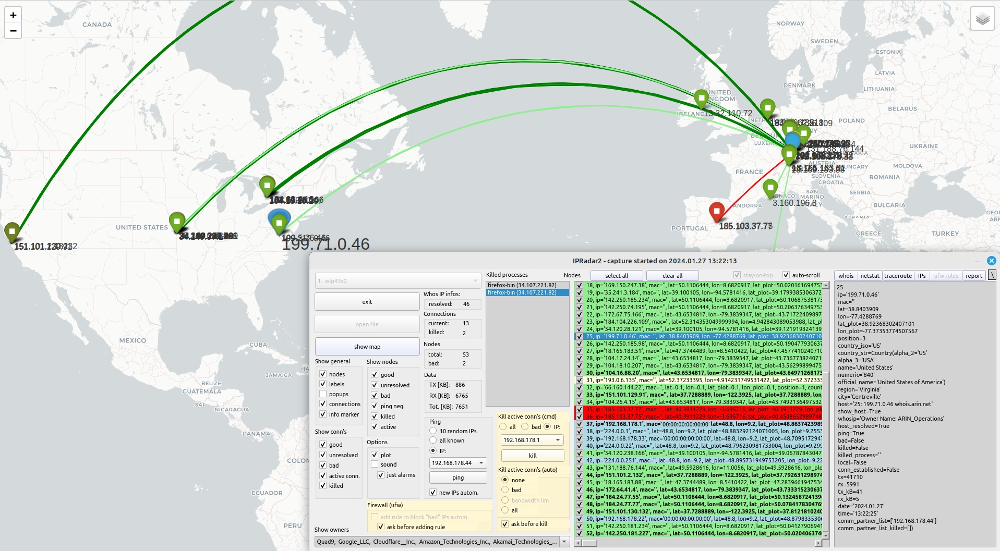
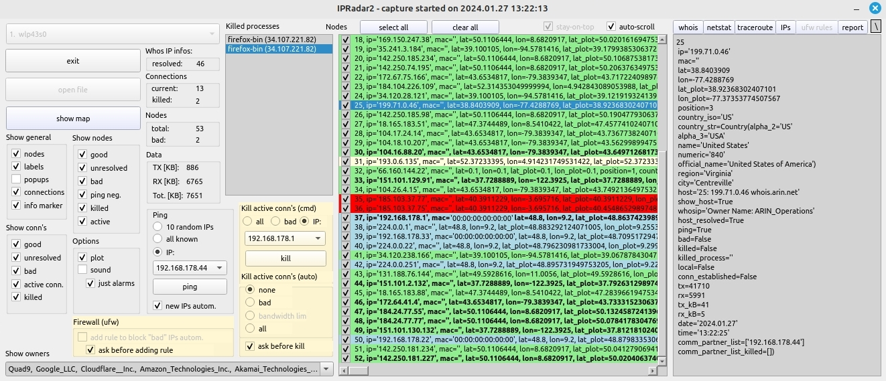

# IPRadar2 for Linux

## Installation
- Install system dependencies:
  ```bash
  sudo apt update
  sudo apt install -y python3-dev
  sudo apt install -y build-essential
  sudo apt install -y libasound2-dev
  sudo apt install -y whois
  sudo apt install -y traceroute
  sudo apt install -y tshark
  sudo apt install -y qttools-dev-tools
  sudo apt install -y qttools-dev
  sudo apt install -y python3-pyqt5
  sudo apt install -y gst123
  sudo apt install -y gstreamer1.0-adapter-pulseeffects
  sudo apt install -y gstreamer1.0-alsa
  sudo apt install libcairo2-dev libgirepository1.0-dev pkg-config
  sudo apt install libgirepository-2.0-dev
  ```
- Upgrade Python tooling and install the package:

  ```bash
  python -m pip install --upgrade pip setuptools wheel
  pip install ipradar2
  ```
And check [READ_ME.txt](https://github.com/ClarkFieseln/IPRadar2ForLinux/blob/main/READ_ME.txt "READ_ME.txt") for more information.

## Overview
Real-time detection and defense against malicious network activity and policy violations (exploits, port-scanners, advertising, telemetry, state surveillance, etc.)

For more information you can check the Windows variant of this tool, which is very similar:

[Article in Code Project (Windows version)](https://www.codeproject.com/Articles/5269206/IP-Radar-2 "IP Radar 2 Article in Code Project")

[Video Playlist (Windows version)](https://www.youtube.com/watch?v=NGNqWnDRBPk&list=PLX24fhcibpHXfTWYm8Vfhc4SB6sIGgtck "IP Radar 2 Demo Video")

## Intrusion Detection and Prevention in Real Time Based e.g. on Geographical Locations of Hosts

<!-- #  -->


## Main Window

<!--  -->


## IPRadar (video playlist of original version)

[Video Playlist (original version)](https://www.youtube.com/watch?v=EBGdES2b-zE&list=PLX24fhcibpHUbVMLRvzB5kC9kmXOvMXq_ "IP Radar (original SW) Video Playlist")

## PyPI project

[PyPI project](https://pypi.org/project/ipradar2/ "PyPI project")
